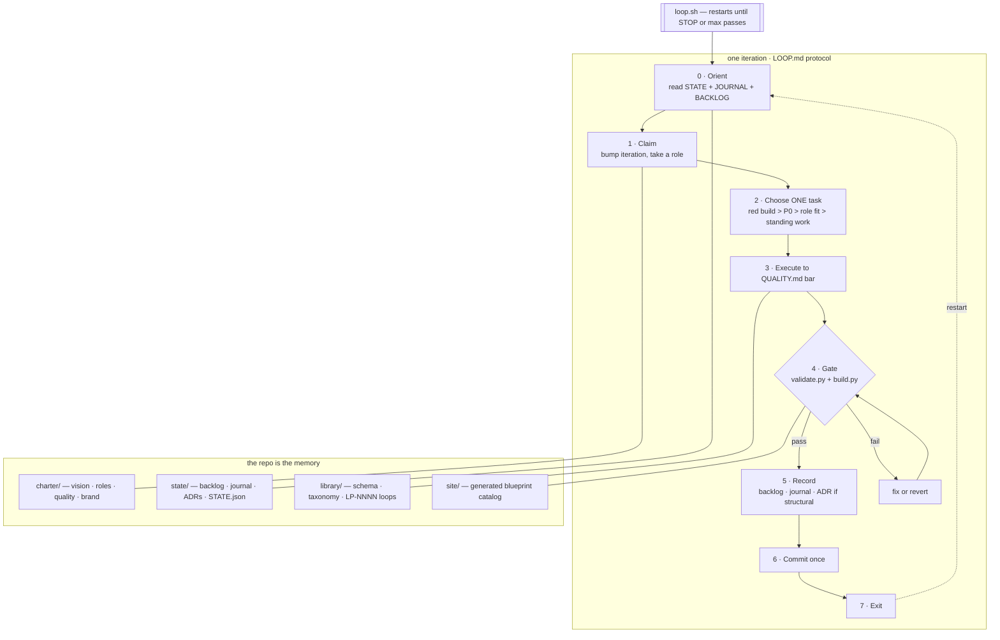

# Weft

```
W   W  EEEEE  FFFFF  TTTTT
W   W  E      F        T
W W W  EEEE   FFFF     T
W W W  E      F        T
 W W   EEEEE  F        T   >------------->
```

<sub>Named by the system itself at iteration 5 (codename was "Loopforge"; see charter/BRAND.md, ADR-003).</sub>

A self-running library of **loop prompts** for Claude Code — prompts designed to be run
over and over, where all memory lives in files and every pass leaves the work one step
better. The twist: this library is *built by one of its own loops.* Point `loop.sh` at
it and a single agent rotates through company roles — builder, reviewer, librarian,
designer, auditor, scout — growing, curating, branding, and auditing the collection,
one commit per iteration, forever (or until you `touch STOP`).

## Quickstart

```bash
npm install -g @anthropic-ai/claude-code   # if you don't have Claude Code yet
cd loopforge
./loop.sh 5          # run 5 supervised-ish iterations; watch it work
touch STOP           # halt gracefully, any time
```

Prefer to drive manually? Open Claude Code in this directory and type `/loop` for one
iteration, or `/status` for a health report.

## What one iteration looks like



## The company

One agent, many hats, on a fixed rotation (`charter/ROLES.md`): **builders** write new
loops to `library/SCHEMA.md`; **reviewers** score them against `charter/QUALITY.md` and
promote draft → reviewed → canonical; the **librarian** owns taxonomy and dedupe; the
**designer** owns brand and site — including the Naming Ceremony, where the system
picks its own name and identity; the **auditor** reads the whole system, files audits,
and may propose amendments to the protocol itself; the **scout** feeds the idea
backlog. Every structural decision becomes an ADR in `state/DECISIONS.md`, so the
reasoning outlives the iteration that had it.

Self-modification is allowed but never impulsive: changing `LOOP.md`, `loop.sh`, or
`tools/` takes two iterations — one to propose (ADR), a later one to implement.

## Steering it

You are the board of directors; the backlog is your channel.

- Add ideas or priorities to `state/BACKLOG.md` (mark urgent things **P0**).
- Read `state/JOURNAL.md` and `git log` to see exactly what happened and why.
- Veto anything by reverting its commit and leaving a note in the backlog.
- Open `site/index.html` for the catalog; `library/INDEX.md` is the text version.

## Safety — read before unattended runs

`loop.sh` defaults to `--dangerously-skip-permissions` because unattended loops can't
stop to ask — and it makes you type `SANDBOXED` once before proceeding, because the
flag means what it says. **Run unattended loops in a container or dedicated VM with
only this repo mounted.** Git is the undo button; `state/runs/` keeps per-pass logs;
the harness halts itself after 3 consecutive failures or any post-pass validation
failure. For semi-supervised runs on your own machine:

```bash
LOOP_PERMS="--permission-mode acceptEdits" ./loop.sh 5
```

## Layout

```
LOOP.md                  the iteration protocol — the engine
loop.sh                  the harness (STOP file, run logs, failure cutoff)
CLAUDE.md                standing rules for any Claude Code session here
.claude/commands/        /loop and /status
charter/                 VISION · ROLES · QUALITY · BRAND
state/                   STATE.json · BACKLOG · JOURNAL (append-only) · DECISIONS
library/                 SCHEMA · categories.json · loops/<category>/LP-NNNN-*.md · INDEX (generated)
tools/                   validate.py + build.py — the gates
site/                    generated catalog (pre-brand blueprint v0)
reviews/                 review passes and audits (append-only)
```

Seeded with five loops (LP-0001…LP-0005) spanning micro → epic, including
`LP-0005 Library Grower` — the loop that maintains the library it lives in.
